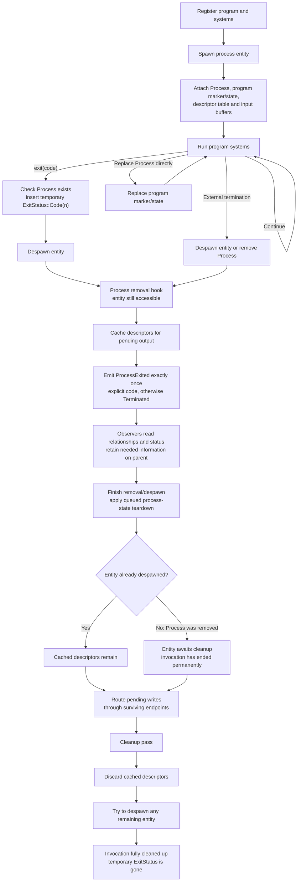

# Process lifecycle

A process entity is one invocation of a registered program. `Process` holds its
program identity, arguments, environment, and signal overrides. Its program's
marker component selects the invocation for ordinary Bevy systems. The entity
also owns its descriptor table and input buffers.

## Running processes

Register a program before spawning its invocations. Registration associates a
program name with its marker component; `app.program::<T>().add_systems(schedule,
systems)` also installs those systems in `ProcessSystems::RunPrograms` and
ensures the schedule has process output routing and cleanup.

One system can advance every invocation of its program. State belongs in
components on each invocation, so two invocations have independent state.
Program state needs no special trait beyond `Component`; required components
provide defaults when the marker is inserted. A program can also have no state.
`Local<T>` is shared by all invocations handled by that system and should not
hold per-invocation state.

```rust
use q_proc::prelude::*;

#[derive(Component, Default, Debug, ProgramLabel)]
#[program_label("countdown")]
#[require(Ticks)]
struct Countdown;

#[derive(Component, Default)]
struct Ticks(u32);

/// Advances each invocation and completes it after three ticks.
fn run_countdown(
    mut processes: Query<(Entity, &mut Ticks), With<Countdown>>,
    mut commands: Commands,
) {
    for (process, mut ticks) in &mut processes {
        ticks.0 += 1;
        if ticks.0 >= 3 {
            commands.entity(process).exit(0);
        }
    }
}
```

Program markers and their required components are removed when `Process` is
removed, replaced, or despawned. Require only program-owned state: removing a
marker also removes its requirements, including any shared component used for
another purpose. Replacing `Process` directly switches the program and resets
its marker/state without emitting an exit notification. Removing and then
reinserting `Process` still ends the invocation permanently.

Input is demultiplexed into process-local buffers in `First`. Programs emit
`ProcessWriteMsg<T>` with their entity and descriptor number. Routing resolves
the descriptor to a typed endpoint, which can be shared by several processes.
Terminal adaptation and foreground job control belong to `q_shell`.

## Exit notification

`Process::on_remove` is the sole source of `ProcessExited`. It runs for component
removal and entity despawning, and emits one notification for that invocation's
end. `exit(code)` sets a temporary `ExitStatus::Code(n)` component and despawns
the entity in one guarded operation. The removal hook reads that component.
Without an explicit status, the hook reports `ExitStatus::Terminated`; this
currently means an unspecified termination, not a specific signal such as
SIGTERM.

The event targets the ending process entity. Observers run synchronously inside
the hook and can read its components and relationships. Owners can use that
information to retain the status in their own state. `ExitStatus` on the child
only passes information to the hook and disappears with the entity; there is no
zombie process waiting for its parent to collect a result.

Commands queued by an observer execute after removal. When the operation is a
despawn, the child is already gone by then; use `try_*` commands when targeting
it. The descriptor table is also removed before queued observer commands run.

Ordinary systems use deferred `Commands`; termination takes effect when those
commands are applied. `commands.entity(process).exit(code)` queues one operation
that checks for `Process`, sets the status, and despawns. If the entity is already
gone or has no `Process`, it does nothing. Repeated exits therefore report only
the first exit that ends the invocation, without leaving a stray status on an
unrelated entity.

Exclusive systems use the same operation through `EntityWorldMut` immediately:

```rust
world.entity_mut(process).exit(code);
```

## Cleanup and final output

The removal hook caches the descriptor table in `ClosingProcessIo` before
emitting the exit notification. This resource holds I/O metadata until pending
writes are routed, even if the process entity has already been despawned.

Process schedules run in this order:

1. `RunPrograms` runs ordinary program systems.
2. A deferred-command barrier applies their commands, including termination.
3. `RouteWrites` resolves all registered message lanes, using live descriptor
   tables or the cached tables of ended processes.
4. `Cleanup` discards the cached tables and tries to despawn any entities left
   behind by removing `Process`.

`First` demultiplexes input but does not clear the cache. An invocation ending in
`Last` or between frames therefore keeps its descriptors until the next routing
pass, normally `PreUpdate`. Writes after that cache has been discarded cannot be
routed. Closed endpoints are still rejected, even when a descriptor was cached.



Despawn also removes the entity's relationships. In `q_shell`, shell despawning
cascades to owned jobs, and removal of foreground relationships restores the
shell's terminal foreground when applicable. These effects happen during the
actual despawn, which can precede output routing; the cached descriptors let
pending output continue through surviving endpoints afterward.
